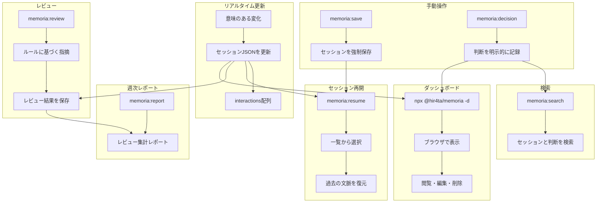

# memoria

Claude Codeの長期記憶を実現するプラグイン

セッションのリアルタイム保存、技術的な判断の記録、Webダッシュボードでの管理を提供します。

## 機能

### コア機能
- **明示的セッション保存**: `/memoria:save` または「セッション保存して」で保存
- **APIフォールバック**: Auto-Compact前とセッション終了時にOpenAI APIで自動保存
- **セッション再開**: `/memoria:resume` で過去のセッションを再開
- **技術的な判断の記録**: `/memoria:decision` で判断を記録
- **ルールベースレビュー**: `dev-rules.json` / `review-guidelines.json` に基づくレビュー
- **週次レポート**: レビュー結果を集計したMarkdownレポートを自動生成
- **Webダッシュボード**: セッション・判断記録の閲覧・編集

### 開発ワークフロー
- **ブレインストーミング**: ソクラティック質問 + 記憶参照で設計 (`/memoria:brainstorm`)
- **計画作成**: 2-5分単位のTDDタスク分割 (`/memoria:plan`)
- **TDD**: RED-GREEN-REFACTORサイクルの厳格強制 (`/memoria:tdd`)
- **デバッグ**: 根本原因分析 + エラーパターン参照 (`/memoria:debug`)
- **二段階レビュー**: 仕様準拠 + コード品質 (`/memoria:review --full`)

## 課題と解決（導入メリット）

### Claude Code 開発で起きがちな課題

- **コンテキストの消失**: セッション終了やAuto-Compactで会話の文脈が失われる
- **判断の不透明化**: 「なぜこの設計にしたのか」が後から追えない
- **知見の再利用が難しい**: 過去のやり取りや決定を検索・参照しづらい

### memoria でできること／解消できること

- **自動保存 + 再開**で、セッションを跨いだ文脈の継続が可能
- **判断記録**で、理由・代替案を後から追跡
- **検索とダッシュボード**で、過去の記録を素早く参照
- **レビュー機能**で、リポジトリ固有の観点に基づいて指摘
- **週次レポート**で、レビュー観点の改善と共有が容易

### チーム利用のメリット

- `.memoria/` のJSONは**Git管理可能**なので、判断や会話の履歴をチームで共有できる
- オンボーディングやレビュー時に「背景・経緯」を短時間で把握できる

## インストール

### 前提条件

- **jq**: フックでJSON処理に使用します

```bash
# macOS
brew install jq

# Ubuntu/Debian
sudo apt-get install jq

# Windows (Chocolatey)
choco install jq

# Windows (Scoop)
scoop install jq

# Windows (winget)
winget install jqlang.jq
```

### プラグインのインストール

Claude Code内で以下を実行

```bash
/plugin marketplace add hir4ta/memoria-marketplace
/plugin install memoria@memoria-marketplace
```

Claude Codeを再起動して完了

## アップデート

Claude Code内で以下を実行

```bash
/plugin marketplace update memoria-marketplace
```

Claude Codeを再起動

### 自動更新を有効にする（推奨）

1. `/plugin` を実行
2. Marketplaces タブを選択
3. `memoria-marketplace` を選択
4. "Enable auto-update" を有効化

これによりClaude Code起動時に自動でアップデートされます

## 設定（オプション）

APIフォールバックによる自動セッション保存を有効にするには、`/memoria:init` を実行するか、手動で `~/.claude/memoria.json` を作成してください：

```json
{
  "openai_api_key": "sk-..."
}
```

| フィールド | 必須 | 説明 |
|-----------|------|------|
| `openai_api_key` | いいえ | 設定すると自動保存が有効になる |

**`openai_api_key` なし**: `/memoria:save` での手動保存のみ。

**`openai_api_key` あり**: 自動保存が有効になり、以下のタイミングで保存：
- Auto-Compact前（status: `draft`）
- セッション終了時（status: `complete`）

## 使い方

### セッション保存

| 方法 | タイミング | ステータス |
|------|----------|-----------|
| **明示的保存** | `/memoria:save` または「セッション保存して」 | `complete` |
| **PreCompact** | Auto-Compact前（API） | `draft` |
| **SessionEnd** | セッション終了時（API） | `complete` |

**注意**: PreCompact/SessionEnd のAPIフォールバックには `~/.claude/memoria.json` の設定が必要です。

### コマンド

| コマンド | 説明 |
| --------- | ------ |
| `/memoria:init` | 設定ファイルを初期化（`~/.claude/memoria.json`） |
| `/memoria:resume [id]` | セッションを再開（ID省略で一覧表示） |
| `/memoria:save` | セッション保存 + 会話からルール抽出 |
| `/memoria:decision "タイトル"` | 技術的な判断を記録 |
| `/memoria:search "クエリ"` | セッション・判断記録を検索 |
| `/memoria:review [--staged\|--all\|--diff=branch\|--full]` | ルールに基づくレビュー（--fullで二段階） |
| `/memoria:report [--from YYYY-MM-DD --to YYYY-MM-DD]` | 週次レビューレポート |
| `/memoria:brainstorm [トピック]` | ソクラティック質問 + 記憶参照で設計 |
| `/memoria:plan [トピック]` | 2-5分TDDタスクに分割した計画作成 |
| `/memoria:tdd` | RED-GREEN-REFACTOR厳格サイクル |
| `/memoria:debug` | 根本原因分析 + エラーパターン参照 |

### 推奨ワークフロー

```
brainstorm → plan → tdd → review
```

1. **brainstorm**: ソクラティック質問 + 記憶参照で設計
2. **plan**: 2-5分TDDタスクに分割
3. **tdd**: RED → GREEN → REFACTOR で実装
4. **review**: 仕様準拠（--full）+ コード品質をレビュー

### ダッシュボード

プロジェクトディレクトリで以下を実行

```bash
npx @hir4ta/memoria --dashboard
```

ブラウザで <http://localhost:7777> を開く。

ポート変更:

```bash
npx @hir4ta/memoria --dashboard --port 8080
```

#### 画面一覧

- **Sessions**: セッション一覧・詳細・編集・削除
- **Decisions**: 技術的な判断の一覧・作成・編集・削除
- **Rules**: 開発ルール・レビュー観点の閲覧・編集

## 仕組み



## データ保存

すべてのデータは `.memoria/` ディレクトリにJSON形式で保存

```text
.memoria/
├── tags.json         # タグマスターファイル（93タグ、表記揺れ防止）
├── sessions/         # セッション履歴 (YYYY/MM)
├── decisions/        # 技術的な判断 (YYYY/MM)
├── rules/            # 開発ルール / レビュー観点
├── reviews/          # レビュー結果 (YYYY/MM)
└── reports/          # 週次レポート (YYYY-MM)
```

Gitでバージョン管理可能です。`.gitignore` に追加するかはプロジェクトに応じて判断してください。

### セッションJSONスキーマ

セッションは **分析向け** のスキーマを使用します。定量データ（metrics）と定性データ（summary）を分離し、files/decisions/errorsを独立配列として集計可能にしています。

```json
{
  "id": "abc12345",
  "sessionId": "claude-code-からの-full-uuid",
  "createdAt": "2026-01-27T10:00:00Z",
  "endedAt": "2026-01-27T12:00:00Z",
  "context": {
    "branch": "feature/auth",
    "projectDir": "/path/to/project",
    "user": { "name": "tanaka", "email": "tanaka@example.com" }
  },
  "summary": {
    "title": "JWT認証機能の実装",
    "goal": "JWTベースの認証機能を実装",
    "outcome": "success",
    "description": "RS256署名でJWT認証を実装"
  },
  "metrics": {
    "durationMinutes": 120,
    "filesCreated": 2,
    "filesModified": 1,
    "decisionsCount": 2,
    "errorsEncountered": 1,
    "errorsResolved": 1
  },
  "files": [
    { "path": "src/auth/jwt.ts", "action": "create", "summary": "JWTモジュール" }
  ],
  "decisions": [
    {
      "id": "dec-001",
      "topic": "認証方式",
      "choice": "JWT",
      "alternatives": ["セッションCookie"],
      "reasoning": "マイクロサービス間の認証共有が容易",
      "timestamp": "2026-01-27T10:15:00Z"
    }
  ],
  "errors": [
    {
      "id": "err-001",
      "message": "secretOrPrivateKey must be asymmetric",
      "type": "runtime",
      "resolved": true,
      "solution": "RS256用にPEM形式に変更"
    }
  ],
  "webLinks": ["https://jwt.io/introduction"],
  "tags": ["auth", "jwt", "backend"],
  "sessionType": "implementation",
  "status": "complete"
}
```

### 更新トリガー

Claude Code は意味のある変化があった時にセッションJSONを更新します：

| トリガー | 更新内容 |
|---------|---------|
| セッションの目的が明確になった | `summary.title`, `summary.goal`, `sessionType` |
| ファイルを変更した | `files` に追加、`metrics` 更新 |
| 技術的決定を下した | `decisions` に追加 |
| エラーに遭遇・解決した | `errors` に追加 |
| URLを参照した | `webLinks` |
| 新しいキーワードが出現 | `tags`（tags.jsonを参照） |

**注意**: 明示的に `/memoria:save` を実行するか、APIフォールバックが発動するまでセッションは保存されません。

### セッションタイプ

`sessionType` フィールドはセッションの種類を分類します。

| タイプ | 説明 |
|--------|------|
| `decision` | 決定サイクルあり（設計判断、技術選択など） |
| `implementation` | コード変更あり |
| `research` | リサーチ・学習・キャッチアップ |
| `exploration` | コードベース探索 |
| `discussion` | 議論・相談のみ |
| `debug` | デバッグ・調査 |
| `review` | コードレビュー |

### タグ

タグは `.memoria/tags.json` から選択され、表記揺れを防止します（例: 「フロント」→「frontend」）。マスターファイルには11カテゴリ93タグが含まれています：

- **domain**: frontend, backend, api, db, infra, mobile, cli
- **phase**: feature, bugfix, refactor, test, docs
- **ai**: llm, ai-agent, mcp, rag, vector-db, embedding
- **cloud**: serverless, microservices, edge, wasm
- その他...

## ライセンス

MIT
