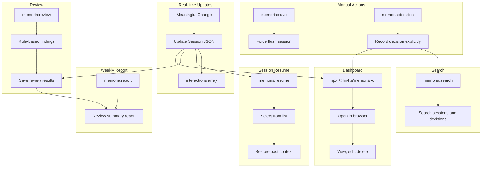

# memoria

Long-term memory plugin for Claude Code

Provides automatic session saving, technical decision recording, and web dashboard management.

## Features

- **Real-time Session Updates**: Session JSON is updated when meaningful changes occur
- **Session Resume**: Resume past sessions with `/memoria:resume`
- **Technical Decision Recording**: Record decisions with `/memoria:decision`
- **Rule-based Review**: Code review based on `dev-rules.json` / `review-guidelines.json`
- **Weekly Reports**: Auto-generate Markdown reports aggregating review results
- **Web Dashboard**: View and edit sessions, decisions, and rules

## Problems Solved

### Common Issues in Claude Code Development

- **Context Loss**: Conversation context is lost on session end or Auto-Compact
- **Opaque Decisions**: "Why did we choose this design?" becomes untraceable
- **Hard to Reuse Knowledge**: Past interactions and decisions are hard to search and reference

### What memoria Enables

- **Auto-save + Resume** enables context continuity across sessions
- **Decision Recording** tracks reasoning and alternatives for later review
- **Search and Dashboard** for quick access to past records
- **Review Feature** for repository-specific code review
- **Weekly Reports** for improving and sharing review practices

### Team Benefits

- `.memoria/` JSON files are **Git-manageable**, enabling team sharing of decisions and session history
- Quickly understand background and context during onboarding or reviews

## Installation

### Prerequisites

- **jq**: Used for JSON processing in hooks

```bash
# macOS
brew install jq

# Ubuntu/Debian
sudo apt-get install jq

# Windows (Chocolatey)
choco install jq

# Windows (Scoop)
scoop install jq

# Windows (winget)
winget install jqlang.jq
```

### Plugin Installation

Run the following in Claude Code:

```bash
/plugin marketplace add hir4ta/memoria-marketplace
/plugin install memoria@memoria-marketplace
```

Restart Claude Code to complete installation.

## Update

Run the following in Claude Code:

```bash
/plugin marketplace update memoria-marketplace
```

Restart Claude Code.

### Enable Auto-Update (Recommended)

1. Run `/plugin`
2. Select Marketplaces tab
3. Select `memoria-marketplace`
4. Enable "Enable auto-update"

This will auto-update on Claude Code startup.

## Usage

### Automatic Behavior

| Timing | Action |
|--------|--------|
| Session Start | Suggest related sessions, initialize session JSON |
| During Session | Claude Code updates session JSON on meaningful changes |
| Session End | Fallback processing if not updated, cleanup |

### Commands

| Command | Description |
|---------|-------------|
| `/memoria:resume [id]` | Resume session (show list if ID omitted) |
| `/memoria:save` | Force flush current session |
| `/memoria:decision "title"` | Record a technical decision |
| `/memoria:search "query"` | Search sessions and decisions |
| `/memoria:review [--staged\|--all\|--diff=branch]` | Rule-based code review |
| `/memoria:report [--from YYYY-MM-DD --to YYYY-MM-DD]` | Weekly review report |

### Dashboard

Run in your project directory:

```bash
npx @hir4ta/memoria --dashboard
```

Open <http://localhost:7777> in your browser.

Change port:

```bash
npx @hir4ta/memoria --dashboard --port 8080
```

#### Screens

- **Sessions**: List, view, edit, delete sessions
- **Decisions**: List, create, edit, delete technical decisions
- **Rules**: View and edit dev rules and review guidelines

## How It Works



## Data Storage

All data is stored in `.memoria/` directory as JSON:

```text
.memoria/
├── .current-session  # Current session ID and path
├── tags.json         # Tag master file
├── sessions/         # Session history (YYYY/MM)
├── decisions/        # Technical decisions (YYYY/MM)
├── rules/            # Dev rules / review guidelines
├── reviews/          # Review results (YYYY/MM)
└── reports/          # Weekly reports (YYYY-MM)
```

Git-manageable. Add to `.gitignore` based on your project needs.

## License

MIT
